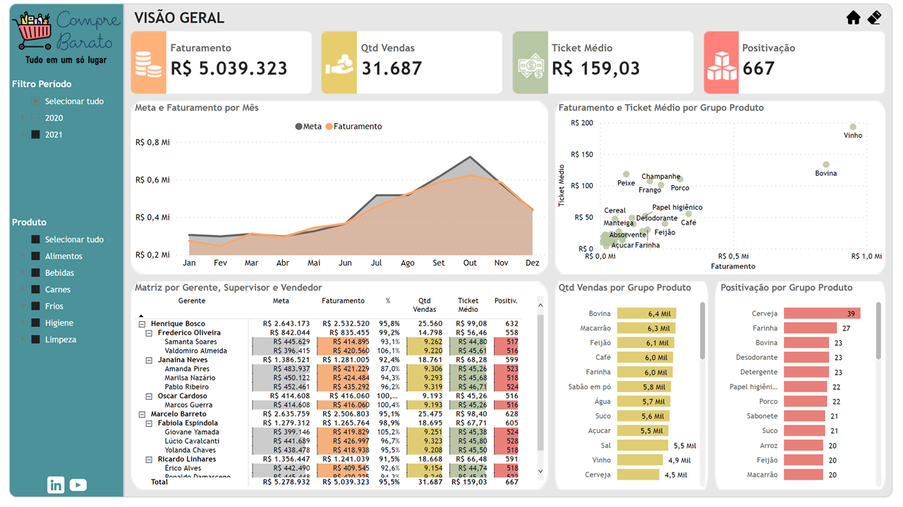
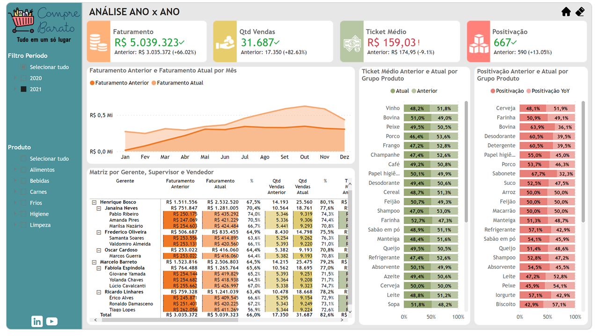
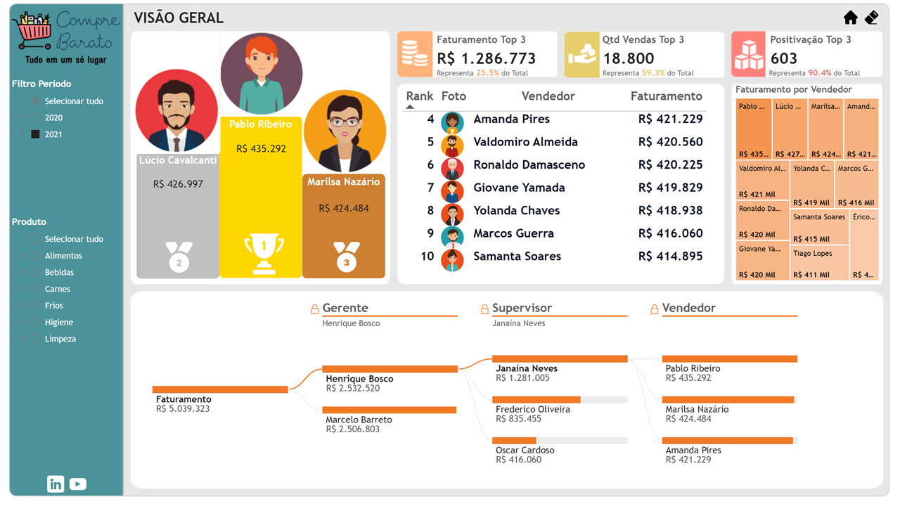
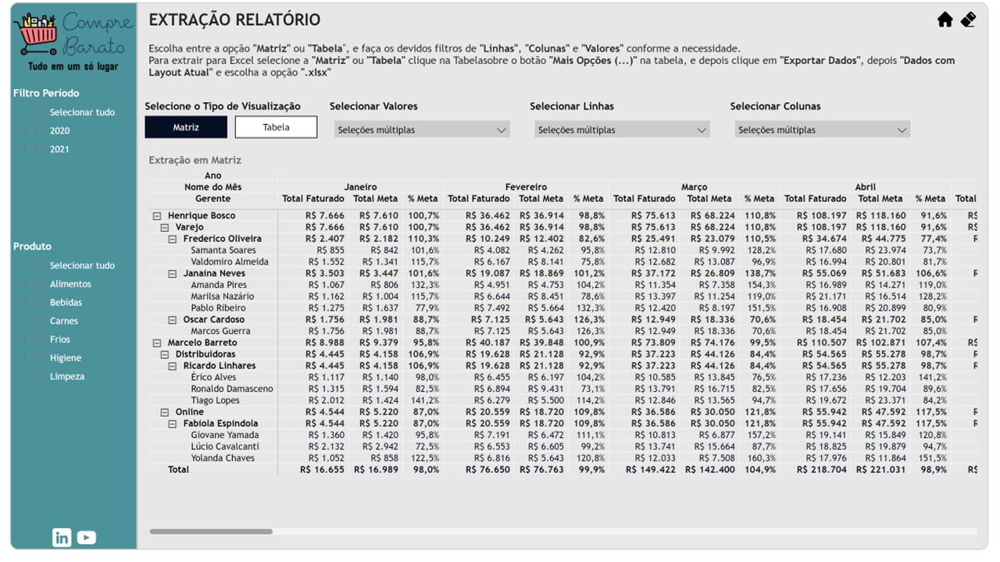

# 📊 Dashboard de Vendas - Compre Barato


Dashboard desenvolvido em Power BI para análise de desempenho comercial, acompanhamento de metas, faturamento, vendedores, produtos e indicadores de vendas.

## Visão Geral

Este projeto contém um relatório Power BI completo utilizando a estrutura de projetos do Power BI (PBIP), permitindo versionamento via Git e colaboração entre desenvolvedores.

O dashboard foi construído utilizando modelo dimensional (Star Schema) e contempla análises de:

- Faturamento
- Metas de vendas
- Ticket médio
- Quantidade de notas fiscais
- Positivação de produtos
- Comparativos Ano x Ano (YoY)
- Performance por vendedor
- Performance por supervisor e gerente
- Performance por produto
- Extrações dinâmicas através de Parâmetros de Campo (Field Parameters)

# 📸 Preview do Dashboard

## Visão Geral


## Comparativo Ano x Ano


## Ranking de Vendedores


## Extração Dinâmica


---

## Estrutura do Repositório

```text
📁 Base de Dados
 └── Base de Dados.xlsx

📁 Dashboard Vendas - Compre Barato.Report
 └── Definição visual do relatório Power BI

📁 Dashboard Vendas - Compre Barato.SemanticModel
 └── Modelo semântico, tabelas, medidas DAX e parâmetros

.gitignore
```

---

## Modelo de Dados

### Tabelas Fato

#### fFaturamento

Tabela principal de vendas contendo:

- Data de emissão
- Número da nota fiscal
- Produto
- Vendedor
- Quantidade de itens
- Valor unitário
- Valor total

#### fMetas

Tabela de metas comerciais por vendedor.

As metas mensais são distribuídas diariamente através da tabela calendário para permitir análises por período.

---

### Tabelas Dimensão

#### dProduto

Informações dos produtos:

- Código do produto
- Produto
- Grupo de produto
- Linha de produto
- Preço unitário
- Rateio

#### dVendedor

Informações da equipe comercial:

- Código do vendedor
- Vendedor
- Supervisor
- Gerente
- Equipe de vendas

#### dCalendario

Tabela calendário utilizada para:

- Inteligência temporal
- Comparações Ano x Ano (YoY)
- Acumulados
- Análises por mês e ano

---

## Principais Indicadores

O projeto possui medidas DAX para acompanhamento de desempenho comercial:

### Indicadores Gerais

- Total Faturado
- Quantidade de Notas
- Ticket Médio
- Positivação
- Total Meta
- % Atingimento da Meta

### Comparativos Ano x Ano (YoY)

- Total Faturado YoY
- Quantidade de Notas YoY
- Ticket Médio YoY
- Positivação YoY
- Meta YoY

---

## Recursos Implementados

### Field Parameters

O dashboard utiliza parâmetros de campo para permitir que o usuário monte visualizações dinâmicas.

É possível selecionar:

- Quais dimensões exibir nas linhas
- Quais dimensões exibir nas colunas
- Quais métricas exibir nos valores

Sem necessidade de criar múltiplos gráficos ou tabelas.

### Inteligência Temporal

Análises comparativas entre períodos utilizando funções DAX de Time Intelligence.

### Navegação e Experiência do Usuário

O relatório possui:

- Navegação por páginas
- Bookmarks
- Tooltips personalizados
- Elementos visuais customizados

---

# Como Clonar o Projeto

Clone o repositório:

```bash
git clone https://github.com/itsmemaikon/bi-compre-barato.git
```

Acesse a pasta:

```bash
cd bi-compre-barato
```

---

# Pré-requisitos

Antes de abrir o projeto, certifique-se de possuir:

- Power BI Desktop atualizado
- Suporte a projetos Power BI (PBIP)

---

# Como Abrir o Dashboard

Após clonar o repositório:

1. Abra o Power BI Desktop.
2. Abra o arquivo `.pbip` localizado na raiz do projeto.
3. Aguarde o carregamento do modelo.

---

# Configuração Obrigatória

O projeto utiliza um parâmetro chamado:

```text
Diretório Base de Dados
```

Este parâmetro aponta para a pasta onde está localizado o arquivo:

```text
Base de Dados\Base de Dados.xlsx
```

Após clonar o projeto, será necessário atualizar o caminho para refletir o diretório local da sua máquina.

## Como Alterar o Parâmetro

### 1. Abrir o Power Query

No Power BI Desktop:

```text
Página Inicial → Transformar Dados
```

### 2. Localizar o Parâmetro

No painel esquerdo procure por:

```text
Diretório Base de Dados
```

### 3. Atualizar o Caminho

Substitua o valor atual pelo caminho da pasta **Base de Dados** existente dentro do repositório clonado.

Exemplo:

```text
C:\Projetos\bi-compre-barato\Base de Dados
```

### 4. Aplicar as Alterações

Clique em:

```text
Fechar e Aplicar
```

O modelo será atualizado utilizando os arquivos locais.

---

# Fonte dos Dados

A base utilizada para demonstração encontra-se no próprio repositório:

```text
Base de Dados\Base de Dados.xlsx
```

As tabelas utilizadas são:

- Vendas
- Produtos
- Vendedores
- Metas

---

# Tecnologias Utilizadas

- Power BI Desktop
- DAX
- Power Query (M)
- PBIP (Power BI Project)
- Git
- GitHub

---

# Objetivo do Projeto

Este projeto tem como objetivo demonstrar boas práticas de desenvolvimento em Power BI, incluindo:

- Modelagem dimensional
- Organização de medidas DAX
- Time Intelligence
- Field Parameters
- Versionamento de projetos Power BI via Git
- Estrutura PBIP para colaboração e manutenção

- ---

## 👨‍💻 Autor

**Maikon Roberto Campanharo Lopes**

Analista de Sistemas | TOTVS Datasul & Progress 4GL • Desenvolvimento Web • Power BI

LinkedIn: https://www.linkedin.com/in/maikonrclopes/

GitHub: https://github.com/itsmemaikon
